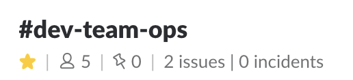

# Ops Team Topic Updater

Updates a Slack channel topic with key stats from monitored services.

The following services are currently supported:

* Jira issues
* PagerDuty incidents

This was created to fulfill a particular need at my work. It makes some assumptions about workflow, so it may or may not be directly suitable for you - but you're welcome to build upon/contribute back etc.!

_Tested with Jira Server 7.2.1._

## Setup

1. **[Create a new Slack app]([api.slack.com/apps](https://api.slack.com/apps))**. It'll need access to these permission scopes:

    * `channels:write`
    * `channels:history`
    * `chat:write:user`

    Full instructions for this step can be found in the [`slack-topic-updater` package](https://github.com/tdmalone/slack-topic-updater#authorisation). You'll need your OAuth Token to continue.

2. **Get the ID of the channel you wish to update.** You can get this from the URL given when right-clicking on a channel name and selecting _Copy Link_. It'll look like this: `C12345678`.

3. **Get a new PagerDuty API token.** This can be done from `https://your-installation.pagerduty.com/api_keys` (API v2).

4. **Set up Jira issue filters and note down the IDs.** You'll need two: one for all issues you want to be included, and one for high priority issues/blockers.

   Filters can be managed from `https://jira.example.com/secure/ManageFilters.jspa`.

5. **Set up a Jira 'service account'.** This is **OPTIONAL** but highly recommended. You'll need to provide a username and password to connect to Jira, so it's suggested that this is a read-only account rather than your own.

   Ensure the account has access to the filters and issues you need it to.

6. **Deploy the app somewhere!** Heroku is recommended due to its simplicity and the fact it provides logical separation of concerns for each of your deployed apps.

    

    You'll need to enter your Slack access token, channel ID, Jira installation and access details, PagerDuty API key, etc. You'll be prompted for all of these while setting it up.

    If you're hosting elsewhere, you can provide all these details via environment variables. These are documented in [app.json](app.json). Note that you'll need at least Node 10.8.0.

7. **Configure app invocation.** To update your Slack topic, the app needs to run! Ideally you'll want to do this via webhook from both Jira and PagerDuty, but you could also invoke it regularly on a schedule.

   Invocation via webhook is recommended because your counts will update pretty much instantly when an event occurs, and because you're then not unnecessarily keeping your app running when it's not needed.

   If you've deployed on Heroku, your app will be accessible at `https://name-of-your-app.herokuapp.com`. You can invoke this from anywhere that can make HTTPS requests. It doesn't need any payload - just a 'ping' to kick off an update. [cron-job.org](https://cron-job.org) is a great way to do this for free.

    Otherwise, to set up invocation from webhooks:

    **Jira:** Head to the webhooks section in your Jira admin (`https://jira.example.com/plugins/servlet/webhooks`) and follow the steps. You'll want to enter a JQL query that covers the issues you're querying in your filter.

    **PagerDuty:** Follow the documentation at https://support.pagerduty.com/docs/webhooks, selecting _Generic V2 Webhook_ when adding the extension to your Service. It does appear that you need to do this for _each_ service you have, however if you have an existing process for automating your PagerDuty settings you may like to use that.

## Problems?

[Submit an issue](https://github.com/tdmalone/ops-team-topic-updater/issues/new). Pull requests also welcome!

## TODO

* Add better error handling
* Add tests (& CI), and linting
* Make workflows more flexible - eg. perhaps only one Jira filter is being used; or only PagerDuty
* Handle pagination when lots of issues and incidents are returned

## License

[MIT](LICENSE).
